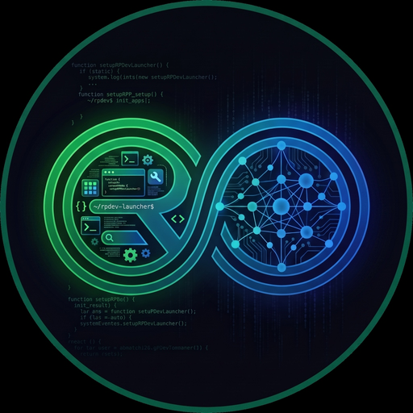

<h1 align="center">
  
   
  RPDev Launcher
</h1>

  <strong>The modern, performance-driven AOSP & Android 16-based launcher tailored for the RPDevs ecosystem.</strong>

  
  
  
  

---

## Overview

**RPDev Launcher** is an open-source, highly customizable Android launcher based on Launcher3 and WindowManager Shell, updated to target modern Android platforms (API 34–37) with Gradle 9+ and AGP 10-ready architecture.

---

## Features :abacus:

### **Some of the main features**

- Rich themes support.
- The Dash.
- Custom search engines.
- Gestures support.
- A unique custom-widget.
- Categories or folders in the app drawer.
- Icon shapes and packs support.
- Customize app icons.
- Desktop grid preference.
- Hide apps.
- Vertical Apps Lists.
- Icons' scaling.
- Back up and restore preferences.

There's also a [developer's document](DEVDOC.md), where the maintainer and collaborators communicate
their TODOs and plans.

## Screenshots :framed_picture:

|  |  |  |
|:--------------------------------------------------------------------------------------------------------------------------------:|:------------------------------------------------------------------------------------------------------:|:--------------------------------------------------------------------------------------------------------:|

|  |  |  |
|:-------------------------------------------------------------------------------------------------------:|:------------------------------------------------------------------------------------------------------:|:--------------------------------------------------------------------------------------------------------:|

## Contributions

If you have knowledge in Java or Kotlin, you can work on additional features or bug fixes, and open pull requests against `RPDevs-Builds/RPDev-Launcher`.

## FAQ

**Is QuickSwitch available?**

No, QuickSwitch is not available.

## Special Thanks :heart:

Thanks to The LawnchairLauncher team for the great work on Lawnchair.

Thanks to <a href="https://github.com/nonaybay">Rafael Venâncio</a> for creating the F-Droid repo.

To [Donno](https://github.com/Donnnno) for the new app icon base.

Thanks to Helena Zhang and Toby Fried for the great [Phosphor icons](https://phosphoricons.com), which we use since 0.9.0.

### Contributors :handshake:

## Copylefted Libre License :scroll:

Our work is licensed under the [GPLv3+](/COPYING). \
The original AOSP Launcher3 code is licensed under the [Apache License, Version 2.0](https://www.apache.org/licenses/LICENSE-2.0).

Copyright © 2025 [Saul Henriquez](https://github.com/saulhdev), [Antonios Hazim](https://github.com/machiav3lli) and [contributors](https://github.com/RPDevs-Builds/RPDev-Launcher/graphs/contributors).

